 *——本篇笔记内容来自 **张龙 — 深入理解 JVM ** 课程*


#### 1、 类加载器深入解析与阶段分解

​	在java代码中，类型的加载、连接与初始化过程都是在程序运行期间完成的。这样可以提供更大的灵活性，增加了更多的可能性。

##### 结束java虚拟机生命周期

1. 执行System.exit()方法
2. 程序正常执行结束
3. 程序异常终止
4. 操作系统出现错误导致java虚拟机进程终止

##### 类的五个阶段

1. 加载

   查找并加载类的二进制数据

2. 连接

   * 验证：确保被加载类的正确性
   * 准备：为类的静态变量分配内存，并将其初始化为默认值
   * 解析：把类中的符号引用转换为直接引用

3. 初始化

   为静态变量赋予正确的初始值

4. 使用

5. 卸载

#### 2、类的加载连接与初始化过程

##### 类的使用方式

###### 1. 主动使用

​	所有的java虚拟机实现必须在每个类或接口被java程序“**首次主动使用**”时才初始化。

 1. 创建类的实例。

 2. 访问某个类或接口的静态变量或对该静态变量赋值。

    *对于静态字段来说，只有直接定义了改字段的类才会被初始化。子类访问父类的静态属性时，子类可能不会被初始化，父类会被初始化。*

3. 调用类的静态方法。

4. 反射（`Class.forName("edu.learn.gwqin.jvm.MyTest1")`）。

5. 初始化一个类的子类。

   *当一个类被初始化时，它的父类一定已经被初始化完毕。*

6. 虚拟机启动时被标记为启动类的类（包含main方法等）。

7. jdk1.7开始提供静态语言支持：java.lang.invoke.MethodHandle实例的解析结果REF_getStatic，REF_putStatic，REF_invokeStatic句柄对应的类没有初始化，则初始化。

###### 2. 被动使用

​	除了主动使用的7种情况外，其他情况都是被动使用，被动使用不会导致类的初始化。

##### 类的加载

​	类的加载指的是将类的.class文件中的二进制数据读入到内存中，将其放在运行时数据区的方法内，然后在内存中创建一个java.lang.Class对象（规范并未说明Class对象位于哪里，HotSpot虚拟机将其放在了方法去中）用来封装类在方法区内的数据结构（反射来源）。

###### 加载方式

1. 本地系统直接加载；
2. 网络下载.class文件；
3. 从zip，jar等归档文件中加载class文件；
4. 从专有的数据库中提取class文件；
5. 将java源文件动态编译为.class文件；

*-XX:+TraceClassLoading：用于追踪类的加载信息并打印。*

#### 3、常量的本质含义与反编译及助记符详解

​	常量在编译阶段会存入到调用这个常量的方法所在的类的常量池中。本质上，调用类并没有直接引用到定义常量的类，因此不会触发定义常量的类的初始化。即A类调用B类的V常量时，V会存到A的常量池中，之后A和B之间没有任何关系，甚至可以将B的class文件删除。

##### 实例一

###### java代码

~~~~~java
package edu.learn.gwqin.jvm;

/**
 * @author: gwqin
 * @date: 2019/7/31 9:59
 * @descrption:
 */
public class MyTest1
{
    public static void main(String[] args)
    {
        System.out.println(MyChild1.str);
    }
}
class MyParent1
{
    public static String str = "hello world";
    static
    {
        System.out.println("MyParent1 static block");
    }
}

class MyChild1 extends MyParent1
{
    static
    {
        System.out.println("MyChild1 static block");
    }
}
~~~~~

###### 运行结果

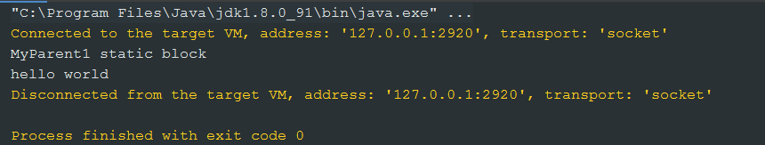

###### 解释

​	通过子类的名字调用父类的静态变量，并没有主动使用子类，所以子类的静态代码块没有被初始化和执行。

##### 实例二

###### java代码

~~~~java
package edu.learn.gwqin.jvm;

/**
 * @author: gwqin
 * @date: 2019/7/31 9:59
 * @descrption:
 */
public class MyTest1
{
    public static void main(String[] args)
    {
        System.out.println(MyChild1.str2);
    }
}
class MyParent1
{
    public static String str = "hello world";
    static
    {
        System.out.println("MyParent1 static block");
    }
}

class MyChild1 extends MyParent1
{
    public static String str2 = "welcome";
    static
    {
        System.out.println("MyChild1 static block");
    }
}
~~~~

###### 运行结果

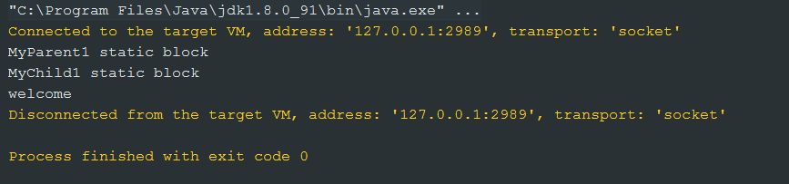

###### 解释

初始化父类的子类，对父类来说也是主动调用，因此父类的静态代码块被初始化并执行。而子类调用了子类的静态变量，也是主动使用（第二条：访问某个类或接口的静态变量或对该静态变量赋值；第五条：初始化一个类的子类）。

###### java代码

~~~~~java
package edu.learn.gwqin.jvm;

/**
 * @author: gwqin
 * @date: 2019/7/31 9:59
 * @descrption: 
 * 
 * 对于静态字段来说，只有直接定义了该字段的类才会被初始化；
 * 当一个类被初始化时，要求其父类全部都已经被初始化完成了。
 * -XX:+TraceClassLoading，用于追踪类的加载信息并打印出来
 * 
 * -XX:+<option>，表示开启option选项
 * -XX:-<option>，表示关闭option选项
 * -XX:<option>=<value>，表示将option选项的值设置为value
 * 
 */
public class MyTest1
{
    public static void main(String[] args)
    {
        System.out.println(MyChild1.str2);
    }
}
class MyParent1
{
    public static String str = "hello world";
    static
    {
        System.out.println("MyParent1 static block");
    }
}

class MyChild1 extends MyParent1
{
    public static String str2 = "welcome";
    static
    {
        System.out.println("MyChild1 static block");
    }
}
~~~~~

###### 运行配置

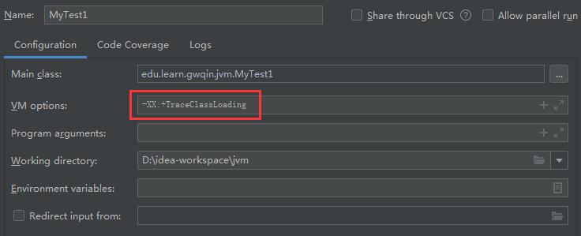

###### 运行结果

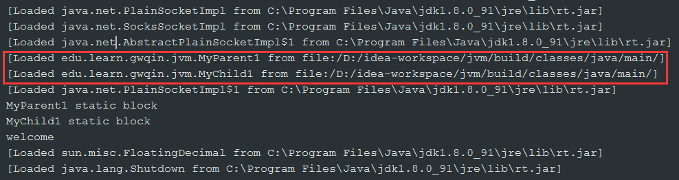

###### 解释

即使没有对MyChild1这个类初始化，但是也完成了对这个类的加载。

##### 实例三

###### java代码

~~~~java
package edu.learn.gwqin.jvm;

/**
 * @author: gwqin
 * @date: 2019/7/31 10:37
 * @descrption:
 */
public class MyTest2
{
    public static void main(String[] args)
    {
        System.out.println(MyParent2.str);
    }
}

class MyParent2
{
    public static String str = "hello world";

    static
    {
        System.out.println("MyParent2 static block");
    }
}
~~~~

###### 运行结果

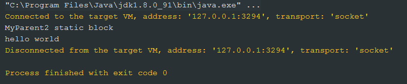

###### java代码

~~~~~java
package edu.learn.gwqin.jvm;

/**
 * @author: gwqin
 * @date: 2019/7/31 10:37
 * @descrption:
 *
 * 常量在编译阶段会被存入到调用这个常量的方法所在类的常量池中，
 * 本质上，调用类并没有直接引用到定义常量的类，因此不会触发定义常量类的初始化。
 * 注意：这里指的是将常量存放到了MyTest2的常量池中，之后MyTest2与MyParent2就没有关系了，
 *      甚至，可以将MyParent2的class文件删除。
 */
public class MyTest2
{
    public static void main(String[] args)
    {
        System.out.println(MyParent2.str);
    }
}

class MyParent2
{
    public final static String str = "hello world"; // final

    static
    {
        System.out.println("MyParent2 static block");
    }
}

~~~~~

###### 运行结果

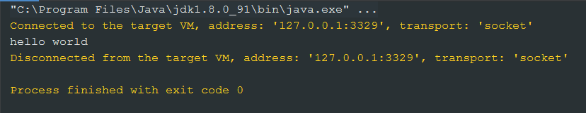

###### 解释

在编译阶段，把final定义的常量放入到调用这个常量的方法所在类的常量池中。

##### 几个助记符

1. ldc：将int、float或是String类型的常量值从常量池中推送至栈顶；
2. bipush：表示将单字节（-128 ~ 127）的常量值推送至栈顶；
3. sipush：表示将一个短整型常量值（-32768 ~ 32767）推送至栈顶；
4. iconst_1：表示将int型的1推送至栈顶（iconst_1 ~ iconst_5）。

#### 4、编译期常量与运行期常量的区别及数组创建本质解析

##### 实例一

###### java代码

```java
package edu.learn.gwqin.jvm;

import java.util.UUID;

/**
 * @author: gwqin
 * @date: 2019/7/31 10:50
 * @descrption:
 * 当一个常量的值并非在编译期间可以确定的，那么其值就不会被放到调用类的常量池中，
 * 这时在运行程序时，会导致主动使用这个常量所在的类，显然会导致这个类的初始化。
 */
public class MyTest3
{
    public static void main(String[] args)
    {
        System.out.println(MyParent3.str);
    }
}

class MyParent3
{
    public final static String str = UUID.randomUUID().toString();

    static
    {
        System.out.println("MyParent3 static block");
    }
}
```

###### 运行结果

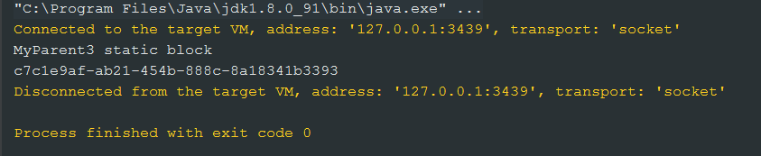

###### 解释

str编译期间不确定，导致MyParent3被初始化，因而静态代码块被初始化并执行。

##### 实例二

###### java代码

~~~~java
package edu.learn.gwqin.jvm;

/**
 * @author: gwqin
 * @date: 2019/7/31 11:12
 * @descrption:
 */
public class MyTest4
{
    public static void main(String[] args)
    {
        MyPsrent4 myPsrent4 = new MyPsrent4();
        System.out.println("=================");
        MyPsrent4 myPsrent5 = new MyPsrent4();
    }
}

class MyPsrent4
{
    static
    {
        System.out.println("MyPsrent4 static block");
    }
}
~~~~

###### 运行结果

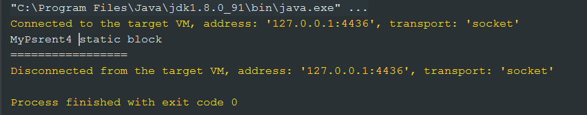

###### 解释

创建一个类的实例，且是在首次主动使用时进行初始化。

##### 实例二

###### java代码

~~~~~java
package edu.learn.gwqin.jvm;

/**
 * @author: gwqin
 * @date: 2019/7/31 11:12
 * @descrption:
 *
 * 助记符：
 * anewarray：表示创建一个引用类型的（如类、接口、数组）数组，并将其引用压入栈顶
 * newarray：表示创建一个指定的原始类型（如int、float、char等）的数组，并将其引用压入栈顶
 *
 */
public class MyTest4
{
    public static void main(String[] args)
    {
//        MyPsrent4 myPsrent4 = new MyPsrent4();
//        System.out.println("=================");
//        MyPsrent4 myPsrent5 = new MyPsrent4();
        MyPsrent4[] myPsrent4s = new MyPsrent4[1];
        System.out.println(myPsrent4s.getClass());

        MyPsrent4[][] myPsrent4s1 = new MyPsrent4[1][1];
        System.out.println(myPsrent4s1.getClass());

        System.out.println(myPsrent4s.getClass().getSuperclass());
        System.out.println(myPsrent4s1.getClass().getSuperclass());

        System.out.println("======");

        int[] ints = new int[1];
        System.out.println(ints.getClass());
        System.out.println(ints.getClass().getSuperclass());
    }
}

class MyPsrent4
{
    static
    {
        System.out.println("MyPsrent4 static block");
    }
}
~~~~~

###### 运行结果


###### 解释

MyPsrent4没有被初始化，类加载器自动生成一种类型，数组类型的类。对于数组实例来说，其类型是由jvm在运行期动态生成的，表示为`[Ledu.learn.gwqin.jvm.MyPsrent4;`这中形式。动态生成的类型，其父类型就是Object。对于数组来说，JavaDoc经常将构成数组的元素为Component，实际上就是将数组降低一个维度后的类型。

当创建一个数据类型的类型时，并不表示对数组元素的实例的使用，仅仅表示创建了数组类型的实例，数组类型的实例类型由运行期虚拟机动态创建出来。

##### 几个助记符

1. anewarray：表示创建一个引用类型的（如类、接口、数组）数组，并将其引用压入栈顶。
2. newarray：表示创建一个指定的原始类型（如int、float、char等）的数组，并将其引用压入栈顶。

#### 5、 接口初始化规则与类加载器准备阶段和初始化阶段的重要意义分析

##### 实例一（接口初始化规则）

###### java代码

~~~~~~java
package edu.learn.gwqin.jvm;

/**
 * @author: gwqin
 * @date: 2019/7/31 12:25
 * @descrption:
 */
public class MyTest5
{
    public static void main(String[] args)
    {
        System.out.println(MyChild5.b);
    }
}

interface MyParent5
{
    public static int a = 5;
}

interface MyChild5 extends MyParent5
{
    public static int b = 6;
}
~~~~~~

###### 运行结果

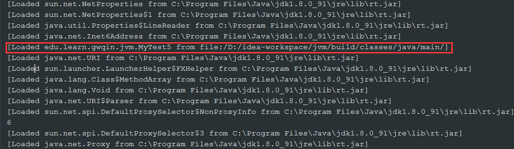

​	从控制台打印的类加载过程中并未找到加载MyChild5和MyParent5的信息。删除MyParent5.class和MyChild5.class文件后程序正常运行。

###### java代码

~~~~java
package edu.learn.gwqin.jvm;

import java.util.Random;

/**
 * @author: gwqin
 * @date: 2019/7/31 12:25
 * @descrption:
 */
public class MyTest5
{
    public static void main(String[] args)
    {
        System.out.println(MyChild5.b);
    }
}

interface MyParent5
{
    public static int a = 5;
}

interface MyChild5 extends MyParent5
{
    public static int b = new Random().nextInt(4);
}
~~~~

###### 运行结果


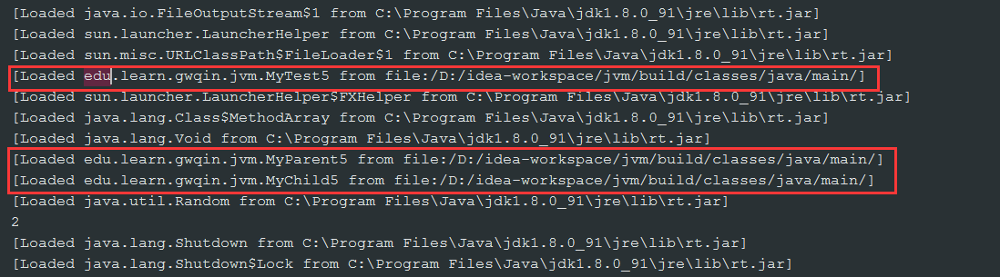

​	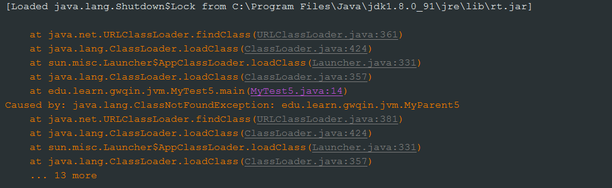

​	从控制台打印的类加载过程中可以找到加载MyChild5和MyParent5的信息。删除MyChild5.class后，报`java.lang.ClassNotFoundException: edu.learn.gwqin.jvm.MyParent5`错误，由于MyChild5的常量只有在运行期才能确定，因此不会将常量b放到调用类的常量池中，这就导致了MyChild5的初始化，也就导致了MyParent5的初始化。

###### java代码

~~~~java
package edu.learn.gwqin.jvm;

import java.util.Random;

/**
 * @author: gwqin
 * @date: 2019/7/31 12:25
 * @descrption:
 */
public class MyTest5
{
    public static void main(String[] args)
    {
        System.out.println(MyChild5.b);
    }
}

interface MyParent5
{
    public static int a = new Random().nextInt(4);
}

interface MyChild5 extends MyParent5
{
    public static int b = 1;
}
~~~~

######　运行结果

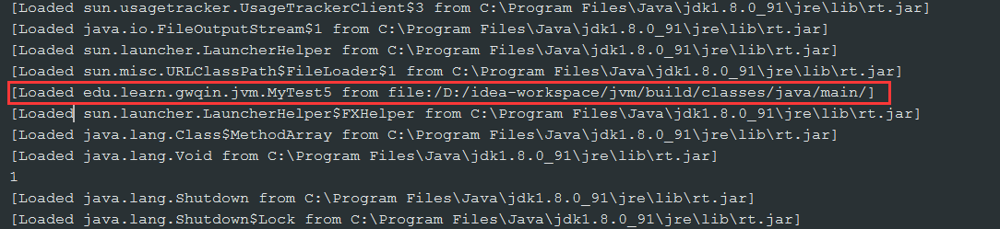

​	从控制台打印的类加载过程中并未找到加载MyChild5和MyParent5的信息。

​	*接口中定义的属性默认是`public  static final`类型。*

##### 实例二（类加载器准备阶段和初始化阶段）

###### java代码

~~~~java
package edu.learn.gwqin.jvm;

/**
 * @author: gwqin
 * @date: 2019/7/31 14:54
 * @descrption:
 */
public class MyTest6
{
    public static void main(String[] args)
    {
        Singleton singleton = Singleton.getInstance();
        System.out.println(Singleton.counter1);
        System.out.println(Singleton.counter2);
    }
}

class Singleton
{
    public static int counter1;
    public static int counter2 = 0;
    private static Singleton singleton = new Singleton();

    private Singleton()
    {
        counter1++;
        counter2++;
    }

    public static Singleton getInstance()
    {
        return singleton;
    }
}
~~~~

###### 运行结果

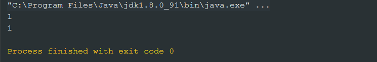

###### java代码

~~~~java
package edu.learn.gwqin.jvm;

/**
 * @author: gwqin
 * @date: 2019/7/31 14:54
 * @descrption:
 */
public class MyTest6
{
    public static void main(String[] args)
    {
        Singleton singleton = Singleton.getInstance();
        System.out.println("==================");
        System.out.println(Singleton.counter1);
        System.out.println(Singleton.counter2);
    }
}

class Singleton
{
    public static int counter1;
    private static Singleton singleton = new Singleton();

    private Singleton()
    {
        counter1++;
        counter2++;
        System.out.println(counter1);
        System.out.println(counter2);
    }
    public static int counter2 = 0;

    public static Singleton getInstance()
    {
        return singleton;
    }
}
~~~~

###### 运行结果

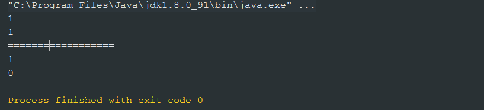

###### 解释

回顾类的五个阶段：

1. 加载

   查找并加载类的二进制数据

2. 连接

   - 验证：确保被加载类的正确性

   - 准备：为类的静态变量分配内存，并将其初始化为默认值

     ​			——此阶段counter1赋值为0，singleton赋值为null，counter2赋值为0。

   - 解析：把类中的符号引用转换为直接引用

3. 初始化

   为静态变量赋予正确的初始值

   ——程序的初始化顺序是**从上而下**的，counter1的值仍为0，而singleton赋值为`new Singleton()`，此时会调用构造器，构造器调用完毕counter1=1，counter2=1，最后执行`public static int counter2 = 0;`couter2的值被赋值为0。

4. 使用

5. 卸载

#### 6、 类加载器深入解析及其重要特性剖析

##### 类的加载

###### 流程图一

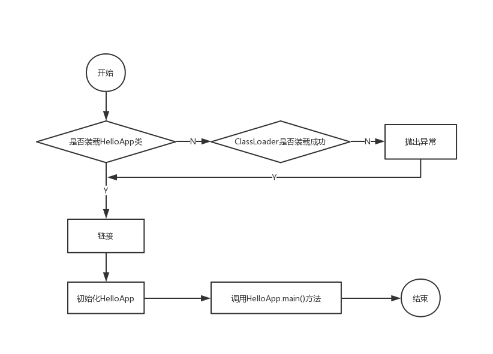

###### 流程图二

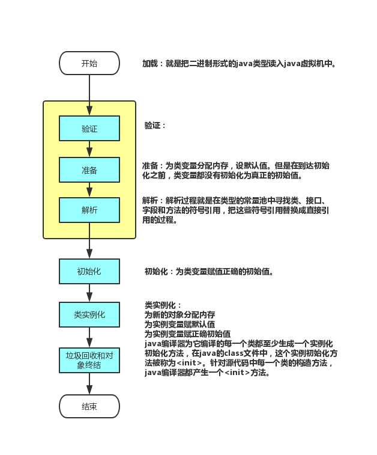

​	类的加载的最终产品是位于内存中的Class对象。

​	Class对象封装了类在方法区内的数据结构，并且向JAVA程序员提供了访问方法区内的数据结构的接口。

###### java虚拟机自带的类加载器

- 根加载器（启动加载器）（Bootstrap）
- 拓展类加载器（Extension）
- 系统（应用）类加载器（System）

###### 用户自定义的类加载器

1. java.lang.ClassLoader的子类
2. 用户可以定制类的加载方式

类加载器并不需要等到某个类被**“首次主动使用”**时再加载它。

JVM规范允许类加载器在预料某个类将要被使用时就预先加载它，如果在预先加载过程中遇到.class文件缺失或者存在错误，类加载器必须在程序**“首次主动使用”**该类时才报告错误（LinkageError错误）。

如果这个类一直没有被程序主动使用，那么类加载器就不会报告错误。

##### 类的验证

类加载后，就进入连接阶段。连接就是将已经读到内存的类的二进制数据合并到虚拟机的运行时环境中去。

##### 类的准备

在准备阶段，java虚拟机为类的静态变量分配内存，并设置默认的初始值。例如，对于以下的Sample类，在准备阶段，将int类型的静态变量a分配4个字节的内存空间，并赋予默认值0，为long类型的静态变量b分配8个字节的内存空间，并且赋予默认值0。

~~~~java
public class Sample
{
    private static int a;
    public static long b;
    static
    {
        b = 2;
    }
    //...
}
~~~~

##### 类的初始化

在初始化阶段，java虚拟机执行类的初始化语句，为类的静态变量赋予初始值。在程序中，静态变量的初始化有两种途径：

1. 在静态变量的声明处进行初始化；

2. 在静态代码块中进行初始化。

   例如在以下代码中，静态变量a和b都被显式初始化，而静态变量c没有被显式初始化，它将保持默认值0。

   ~~~~java
   public class Sample
   {
       private static int a = 1; // 在静态变量的声明处进行初始化
       public static long b;
       public static long c;
       static
       {
           b = 2; // 在静态代码块中进行初始化
       }
       //...
   }
   ~~~~

静态变量的声明语句，以及静态代码块都被看做类的初始化语句，java虚拟机会按照初始化语句在类文件中的先后顺序来依次执行它们。例如当以下Sample类被初始化后，它的静态变量a的取值为4。

~~~~java
public class Sample
{
    static int a = 1; // 在静态变量的声明处进行初始化
    static { a = 2; }
    static { a = 4; }
    public static void main(String args[])
    {
        System.out.printLn("a=" + a); // 打印a=4
    }
    //...
}
~~~~

类的初始化步骤：

1. 假如这个类还没有被加载和连接，那就先加载和连接；
2. 假如类存在直接父类，并且这个父类还没有被初始化，那就先初始化直接父类；
3. 假如类中存在初始化语句，那就依次执行这些初始化语句。

##### 类的初始化时机

###### 主动使用（7种）

1. 创建类的实例。

2. 访问某个类或接口的静态变量或对该静态变量赋值。

   *对于静态字段来说，只有直接定义了改字段的类才会被初始化。子类访问父类的静态属性时，子类可能不会被初始化，父类会被初始化。*

3. 调用类的静态方法。

4. 反射（`Class.forName("edu.learn.gwqin.jvm.MyTest1")`）。

5. 初始化一个类的子类。

   *当一个类被初始化时，它的父类一定已经被初始化完毕。*

6. 虚拟机启动时被标记为启动类的类（包含main方法等）。

7. jdk1.7开始提供静态语言支持：java.lang.invoke.MethodHandle实例的解析结果REF_getStatic，REF_putStatic，REF_invokeStatic句柄对应的类没有初始化，则初始化。

###### 被动使用

​	除了上述七种情形，其他使用java类的方式 都被看作是被动调用，不会导致类的初始化。

	1. 通过子类引用父类的静态字段，为子类的被动使用，不会导致子类初始化；
 	2. 通过数组定义类引用类，为类的被动使用，不会触发此类的初始化；
 	3. 常量在编译阶段会存入调用方法所在的类的常量池中，本质上没有直接引用到定义常量的类，因此不会触发定义常量的类的初始化；

当java虚拟机初始化一个类时，要求它的所有父类都已经被初始化，但是这条规则并不适用于接口。

- 在初始化一个类时，并不会先初始化它所实现的接口。
- 在初始化一个接口时，并不会先初始化它的父接口。

因此，一个父接口并不会因为它的子接口或者实现类的初始化而初始化。只有当程序使用特定接口的静态变量时，才会导致该接口的初始化。

只有当程序访问的静态变量或静态方法确实在当前类或当前接口中定义时，才可以认为时对类或接口的主动使用。

调用ClassLoader类的loadClass方法加载一个类，并不是对类的主动使用，不会导致类的初始化。

##### 类加载器

类加载器是用来把类加载到java虚拟机中，从jdk1.2版本开始，类的加载过程采用父亲委托机制。这种机制能够更好地保证java平台的安全。在委托机制中，除了java虚拟机自带的根类加载器外，其余的类加载器都有且只有一个父加载器。当java程序请求加载器loader1加载Sample类时，loader1首先委托自己的父类加载器加载Sample类，若父类能加载，则由父加载器完成加载任务，否则才由加载器loader1本身加载Sample类。

java虚拟机自带以下几种类加载器：

1. 根（Bootstrap）类加载器

   该加载器没有父加载器。他负责加载虚拟机的核心类库，如java.lang.*等。根类加载器的实现依赖于底层操作系统，属于虚拟机实现的一部分，他并没有继承java.lang.ClassLoader类。

2. 扩展（Extension）类加载器

   他的父加载器为根类加载器。他从java.ext.dirs系统属性所指定的目录中加载类库，或者从jdk的安装目录的jre\lib\ext子目录下加载类库，如果把用户创建的jar文件放在这个目录下，也会自动由扩展类加载器加载。扩展类加载器是纯java类，是java.lang.ClassLoader类的子类。

3. 系统（System）类加载器

   也称为应用类加载器，他的父加载器为扩展类加载器。他从环境变量classpath或者系统属性java.class.path所指定的目录中加载类，他是用户自定义的类加载器的默认父加载器。系统类加载器是纯java类，是java.lang.ClassLoader类的子类。

除了以上虚拟机自带的加载器外，用户还可以定制自己的类加载器。java提供了抽象类java.lang.ClassLoader，所有用户自定义类加载器都应该集成ClassLoader类。

关系图：

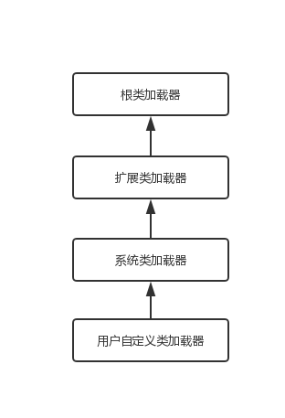

*从小往上是包含关系*

#### 7、初始化对于类和接口的异同点深入解析

##### 回顾类初始化时机

当java虚拟机初始化一个类时，要求它的所有父类都已经被初始化，但是这条规则并不适用于接口。

- 在初始化一个类时，并不会先初始化它所实现的接口。
- 在初始化一个接口时，并不会先初始化它的父接口。

因此，一个父接口并不会因为它的子接口或者实现类的初始化而初始化。只有当程序使用特定接口的静态变量时，才会导致该接口的初始化。

##### 验证一

###### java代码

~~~~java
package edu.learn.gwqin.jvm;

import java.util.Random;

/**
 * @author: gwqin
 * @date: 2019/7/31 12:25
 * @descrption:
 */
public class MyTest5_1
{
    public static void main(String[] args)
    {
        System.out.println(MyChild5_1.b);
    }
}

interface MyParent5_1
{
    public static int a = 4;

    public static Thread thread = new Thread()
    {
        // 实例化块，在构造方法之前执行，当Thread的匿名类初始化的时候，代码块会被执行（每new一个类代码块都会执行一次）
        {
            System.out.println("MyParent5_1 invoked!");
        }
    };
}

class MyChild5_1 implements MyParent5_1
{
    public static int b = 5;
}
~~~~

###### 运行结果

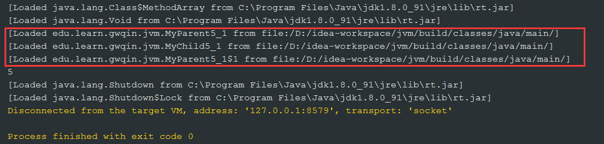

此时，主动调用MyChild5_1的b属性时，MyParent5_1的接口并没有被初始化，但是被加载了。因此，**在初始化一个类时，并不会先初始化它所实现的接口。**

###### java代码

将MyParent5_1改为Class：

~~~~java
package edu.learn.gwqin.jvm;

import java.util.Random;

/**
 * @author: gwqin
 * @date: 2019/7/31 12:25
 * @descrption:
 */
public class MyTest5_1
{
    public static void main(String[] args)
    {
        System.out.println(MyChild5_1.b);
    }
}

class MyParent5_1
{
    public static int a = 4;

    public static Thread thread = new Thread()
    {
        // 实例化块，在构造方法之前执行，当Thread的匿名类初始化的时候，代码块会被执行（每new一个类代码块都会执行一次）
        {
            System.out.println("MyParent5_1 invoked!");
        }
    };
}

class MyChild5_1 extends MyParent5_1
{
    public static int b = 5;
}
~~~~

###### 运行结果

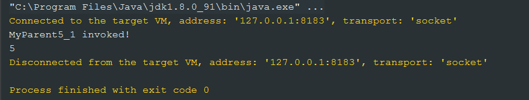

MyParent5_1改为Class后，MyParent5_1被初始化了。因此子类的初始化会导致父类也被初始化。

##### 验证二

###### java代码

~~~~java
package edu.learn.gwqin.jvm;

import java.util.Random;

/**
 * @author: gwqin
 * @date: 2019/7/31 12:25
 * @descrption:
 */
public class MyTest5_1
{
    public static void main(String[] args)
    {
        System.out.println(MyParent5_1.thread);
    }
}

interface MyParent5_1 extends MyGrandpa5_1
{
    public static int a = 4;

    public static Thread thread = new Thread()
    {
        // 实例化块，在构造方法之前执行，当Thread的匿名类初始化的时候，代码块会被执行（每new一个类代码块都会执行一次）
        {
            System.out.println("MyParent5_1 invoked!");
        }
    };
}

interface MyGrandpa5_1
{
    public static Thread thread = new Thread(){
        {
            System.out.println("MyGrandpa5_1 invoked!");
        }
    };
}
~~~~

###### 运行结果

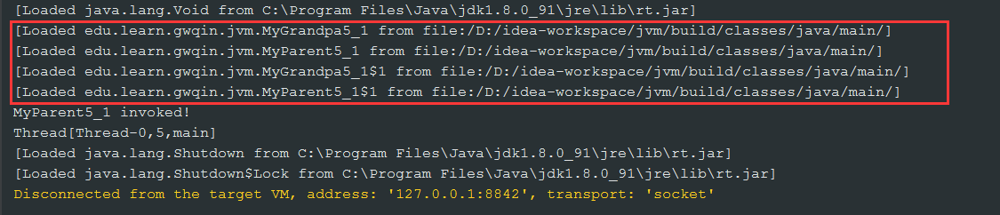

**初始化一个接口时，父接口并没有被初始化，但是父接口被加载了。**

#### 8、类加载器双亲委托机制详解

##### 类加载器的父亲委托机制

###### 逻辑图

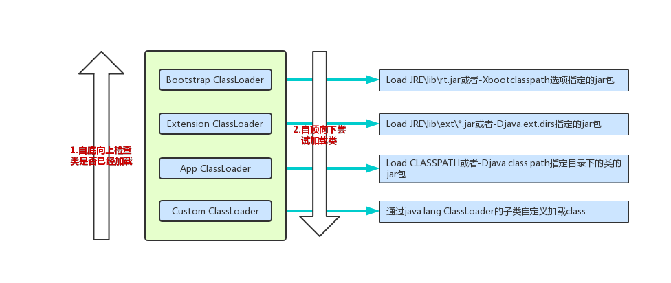

若有一个类加载器能够成功加载Test类（需要加载的目标类），那么这个类加载器被称为**定义类加载器**，所有能成功返回Class对象引用的类加载器（包括定义类加载器）都被称为**初始类加载器**。

###### java代码

~~~~java
package edu.learn.gwqin.jvm;

/**
 * @author: gwqin
 * @date: 2019/8/1 12:53
 * @descrption:
 */
public class MyTest7
{
    public static void main(String[] args) throws ClassNotFoundException
    {
        Class<?> clazz = Class.forName("java.lang.String");
        System.out.println(clazz.getClassLoader());

        Class<?> clazz2 = Class.forName("edu.learn.gwqin.jvm.CC");
        System.out.println(clazz2.getClassLoader());
    }
}
class CC
{

}
~~~~

###### 运行结果

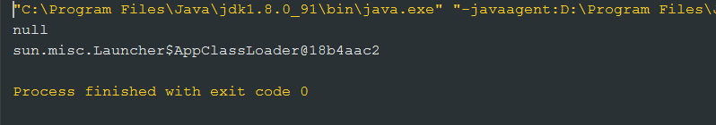

#### 9、类加载器与类初始化深度剖析

###### java代码

~~~~java
package edu.learn.gwqin.jvm;

/**
 * @author: gwqin
 * @date: 2019/8/1 15:03
 * @descrption:
 */
public class MyTest8
{
    public static void main(String[] args)
    {
        System.out.println(FinalTest.x);
    }
}

class FinalTest
{
    public static final int x = 3;

    static
    {
        System.out.println("FinalTest static block");
    }
}
~~~~

###### 运行结果

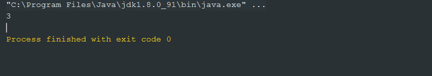

###### 字节码

~~~~java
D:\idea-workspace\jvm\build\classes\java\main>javap -c edu.learn.gwqin.jvm.MyTest8
Compiled from "MyTest8.java"
public class edu.learn.gwqin.jvm.MyTest8 {
  public edu.learn.gwqin.jvm.MyTest8();
    Code:
       0: aload_0
       1: invokespecial #1                  // Method java/lang/Object."<init>":()V
       4: return

  public static void main(java.lang.String[]);
    Code:
       0: getstatic     #2                  // Field java/lang/System.out:Ljava/io/PrintStream;
       3: iconst_3
       4: invokevirtual #4                  // Method java/io/PrintStream.println:(I)V
       7: return
}


~~~~

###### 解释

助记符**iconst_3**说明，MyTest8在调用FinalTest.x时，本质上是对x的静态引用。

###### java代码

~~~~~java
package edu.learn.gwqin.jvm;

import java.util.Random;

/**
 * @author: gwqin
 * @date: 2019/8/1 15:03
 * @descrption:
 */
public class MyTest8
{
    public static void main(String[] args)
    {
        System.out.println(FinalTest.x);
    }
}

class FinalTest
{
    public static final int x = new Random().nextInt(4);

    static
    {
        System.out.println("FinalTest static block");
    }
}
~~~~~

###### 运行结果

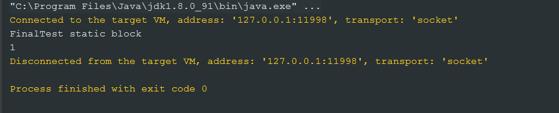

###### 字节码

~~~~java
D:\idea-workspace\jvm\build\classes\java\main>javap -c edu.learn.gwqin.jvm.MyTest8
Compiled from "MyTest8.java"
public class edu.learn.gwqin.jvm.MyTest8 {
  public edu.learn.gwqin.jvm.MyTest8();
    Code:
       0: aload_0
       1: invokespecial #1                  // Method java/lang/Object."<init>":()V
       4: return

  public static void main(java.lang.String[]);
    Code:
       0: getstatic     #2                  // Field java/lang/System.out:Ljava/io/PrintStream;
       3: getstatic     #3                  // Field edu/learn/gwqin/jvm/FinalTest.x:I
       6: invokevirtual #4                  // Method java/io/PrintStream.println:(I)V
       9: return
}
~~~~

###### 解释

助记符**getstatic**说明，MyTest8在调用FinalTest.x时，本质上是FinalTest的主动使用，因此会初始化FinalTest。

###### 代码

~~~~java
package edu.learn.gwqin.jvm;

/**
 * @author: gwqin
 * @date: 2019/8/1 15:19
 * @descrption:
 */
public class MyTest9
{
    static
    {
        System.out.println("MyTest9 static block");
    }

    public static void main(String[] args)
    {
        System.out.println(Child.b);
    }
}

class Parent
{
    static int a = 3;
    static
    {
        System.out.println("Parent static block");
    }
}

class Child extends Parent
{
    static int b = 4;
    static
    {
        System.out.println("Child static block");
    }
}
~~~~

###### 运行结果

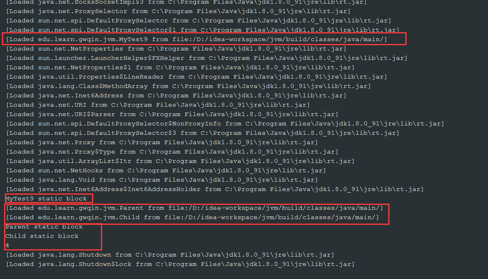

###### 解释

先初始化MyTest9类，打印静态代码块内容，再初始化父类Parent并打印静态代码块内容，然后初始化子类Child并打印子类的静态代码块内容。最后输出结果4。

###### java代码

~~~~java
package edu.learn.gwqin.jvm;

/**
 * @author: gwqin
 * @date: 2019/8/1 15:30
 * @descrption:
 */
public class MyTest10
{
    static
    {
        System.out.println("MyTest10 static block");
    }

    public static void main(String[] args)
    {
        Parent2 parent2;
        System.out.println("=============");
        parent2 = new Parent2();
        System.out.println("=============");
        System.out.println(parent2.a);
        System.out.println("=============");
        System.out.println(Child2.b);
    }
}

class Parent2
{
    static int a = 3;
    static
    {
        System.out.println("Parent2 static block");
    }
}

class Child2 extends Parent2
{
    static int b = 4;
    static
    {
        System.out.println("Child2 static block");
    }
}
~~~~

###### 运行结果

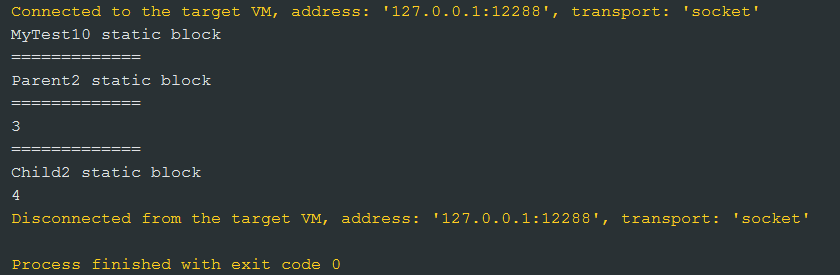

###### 解释

程序执行流程：首先访问main方法，导致MyTest10被初始化，静态代码块执行。声明代码`Parent2 parent2;`不会导致初始化。执行`parent2 = new Parent2();`时，使得Parent2被初始化，静态代码块执行。执行`System.out.println(Child2.b);`时，是对Child2类的主动使用，导致静态代码块执行。但是不会导致Parent2的初始化，因为Parent2已经在执行`parent2 = new Parent2();`时初始化过了。

*——所有的java虚拟机实现必须在每个类或接口被java程序“**首次主动使用**”时才初始化。*

###### java代码

~~~~java
package edu.learn.gwqin.jvm;

/**
 * @author: gwqin
 * @date: 2019/8/1 15:30
 * @descrption:
 */
public class MyTest11
{
    public static void main(String[] args)
    {
        System.out.println(Child3.a);
        Child3.doSomething();
    }
}

class Parent3
{
    static int a = 3;
    static
    {
        System.out.println("Parent3 static block");
    }

    static void doSomething()
    {
        System.out.println("do something");
    }
}

class Child3 extends Parent3
{
    static
    {
        System.out.println("Child3 static block");
    }
}
~~~~

###### 运行结果

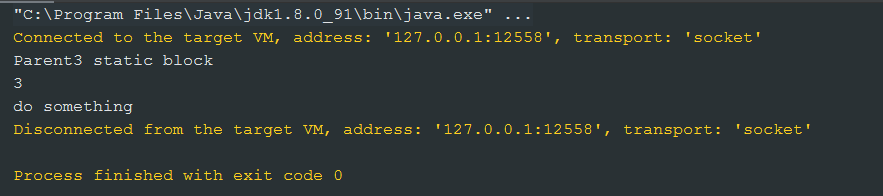

###### 解释

代码中没有使用到Child3的任何数据，因此没有对其产生一个主动使用，所以Child3不会被初始化。

**通过子类调用父类的静态属性或静态方法时，本质上是对父类的主动使用，不是对子类的主动使用。**

###### java代码

~~~~java
package edu.learn.gwqin.jvm;

/**
 * @author: gwqin
 * @date: 2019/8/1 16:07
 * @descrption:
 *
 * 调用ClassLoader的loadClass方法加载一个类，并不是对类的主动使用，不会导致类的初始化。
 *
 */
public class MyTest12
{
    public static void main(String[] args) throws ClassNotFoundException
    {
        ClassLoader loader = ClassLoader.getSystemClassLoader();
        Class<?> clazz = loader.loadClass("edu.learn.gwqin.jvm.CL");
        System.out.println(clazz);
        System.out.println("===================");
        clazz = Class.forName("edu.learn.gwqin.jvm.CL"); // 反射导致类的初始化
        System.out.println(clazz);
    }
}
class CL
{
    static
    {
        System.out.println("Class CL");
    }
}
~~~~

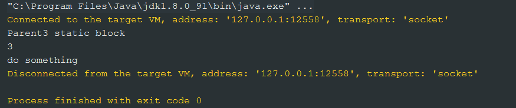

###### 解释

调用ClassLoader的loadClass方法加载一个类，并不是对类的主动使用，不会导致类的初始化。

反射是对类的主动使用。

#### 10、不同的类加载器作用与加载动作分析

##### 隐式和显式加载

1. 隐式加载：程序在运行过程中当遇到new的方式生成对象时，隐式调用类加载器加载对应的类到jvm中；
2. 显式加载：通过`Class.forName()`等方法时会显式地加载对应的类。

##### 类加载的动态体现

一个应用程序总是由n个类组成，java程序启动时，并不是一次把所有的类都加载后运行，它总是先把保证程序运行的基础类一次性加载到jvm中，其它类等到jvm用到的时候再加载。这样的好处是节省了内存的开销。因为java最早就是为嵌入式系统而设计的，内存宝贵，这是一种可以理解的机制，而用到时再加载这也是java动态性的一种体现。

##### 获取类加载器

###### java代码

~~~java
package edu.learn.gwqin.jvm;

/**
 * @author: gwqin
 * @date: 2019/8/1 18:55
 * @descrption:
 */
public class MyTest13
{
    public static void main(String[] args)
    {
        ClassLoader classLoader = ClassLoader.getSystemClassLoader();
        System.out.println(classLoader);

        while (classLoader != null)
        {
            classLoader = classLoader.getParent();
            System.out.println(classLoader);
        }
    }
}
~~~

###### 运行结果

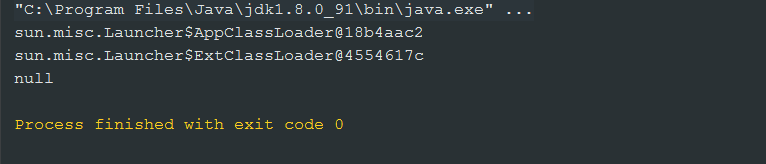

###### java代码

~~~java
package edu.learn.gwqin.jvm;

/**
 * @author: gwqin
 * @date: 2019/8/1 18:58
 * @descrption:
 */
public class MyTest14
{
    public static void main(String[] args)
    {
        ClassLoader classLoader = Thread.currentThread().getContextClassLoader();
        System.out.println(classLoader);
    }
}
~~~

###### 运行结果

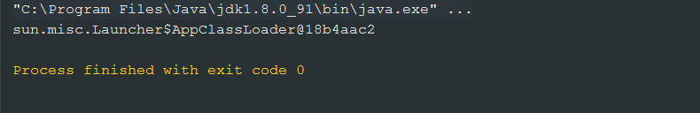

##### 获取资源

###### java代码

~~~java
package edu.learn.gwqin.jvm;

import java.io.IOException;
import java.net.URL;
import java.util.Enumeration;

/**
 * @author: gwqin
 * @date: 2019/8/1 18:58
 * @descrption:
 */
public class MyTest14
{
    public static void main(String[] args) throws IOException
    {
        ClassLoader classLoader = Thread.currentThread().getContextClassLoader();
        System.out.println(classLoader);

        String resourceName = "edu/learn/gwqin/jvm/MyTest13.class";
        Enumeration<URL> urls = classLoader.getResources(resourceName);

        while (urls.hasMoreElements())
        {
            URL url = urls.nextElement();
            System.out.println(url);
        }
    }
}
~~~

###### 运行结果

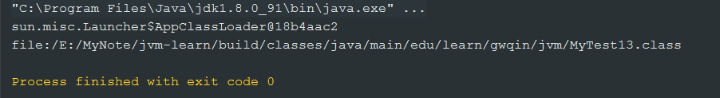

##### 获取ClassLoader的途径

1. 获取当前类的ClassLoader：`clazz.getClassLoader();`
2. 获取当前线程上下文的ClassLoader：`Thread.currentThread().getContextClassLoader();`
3. 获取系统的ClassLoader：`ClassLoader.getSystemClassLoader();`
4. 获取调用者的ClassLoader：`DriverManager.getCallerClassLoader();`

#### 11、ClassLoader源码分析与实例剖析

##### javadoc

~~~java
java.lang
Class ClassLoader
java.lang.Object
java.lang.ClassLoader

 
public abstract class ClassLoader
extends Object
A class loader is an object that is responsible for loading classes. The class ClassLoader is an abstract class. Given the binary name of a class, a class loader should attempt to locate or generate data that constitutes a definition for the class. A typical strategy is to transform the name into a file name and then read a "class file" of that name from a file system.
Every Class object contains a reference to the ClassLoader that defined it.
Class objects for array classes are not created by class loaders, but are created automatically as required by the Java runtime. The class loader for an array class, as returned by Class.getClassLoader() is the same as the class loader for its element type; if the element type is a primitive type, then the array class has no class loader.
Applications implement subclasses of ClassLoader in order to extend the manner in which the Java virtual machine dynamically loads classes.
Class loaders may typically be used by security managers to indicate security domains.
The ClassLoader class uses a delegation model to search for classes and resources. Each instance of ClassLoader has an associated parent class loader. When requested to find a class or resource, a ClassLoader instance will delegate the search for the class or resource to its parent class loader before attempting to find the class or resource itself. The virtual machine's built-in class loader, called the "bootstrap class loader", does not itself have a parent but may serve as the parent of a ClassLoader instance.
Class loaders that support concurrent loading of classes are known as parallel capable class loaders and are required to register themselves at their class initialization time by invoking the ClassLoader.registerAsParallelCapable method. Note that the ClassLoader class is registered as parallel capable by default. However, its subclasses still need to register themselves if they are parallel capable. In environments in which the delegation model is not strictly hierarchical, class loaders need to be parallel capable, otherwise class loading can lead to deadlocks because the loader lock is held for the duration of the class loading process (see loadClass methods).
Normally, the Java virtual machine loads classes from the local file system in a platform-dependent manner. For example, on UNIX systems, the virtual machine loads classes from the directory defined by the CLASSPATH environment variable.
However, some classes may not originate from a file; they may originate from other sources, such as the network, or they could be constructed by an application. The method defineClass converts an array of bytes into an instance of class Class. Instances of this newly defined class can be created using Class.newInstance.
The methods and constructors of objects created by a class loader may reference other classes. To determine the class(es) referred to, the Java virtual machine invokes the loadClass method of the class loader that originally created the class.
For example, an application could create a network class loader to download class files from a server. Sample code might look like:
   ClassLoader loader = new NetworkClassLoader(host, port);
   Object main = loader.loadClass("Main", true).newInstance();
        . . .
 
The network class loader subclass must define the methods findClass and loadClassData to load a class from the network. Once it has downloaded the bytes that make up the class, it should use the method defineClass to create a class instance. A sample implementation is:
     class NetworkClassLoader extends ClassLoader {
         String host;
         int port;

         public Class findClass(String name) {
             byte[] b = loadClassData(name);
             return defineClass(name, b, 0, b.length);
         }

         private byte[] loadClassData(String name) {
             // load the class data from the connection
              . . .
         }
     }
 
Binary names
Any class name provided as a String parameter to methods in ClassLoader must be a binary name as defined by The Java™ Language Specification.
Examples of valid class names include:
   "java.lang.String"
   "javax.swing.JSpinner$DefaultEditor"
   "java.security.KeyStore$Builder$FileBuilder$1"
   "java.net.URLClassLoader$3$1"
 
Since:
1.0
See Also:
resolveClass(Class)
Direct Known Subclasses:
SecureClassLoader
~~~

##### 实例一

###### java代码

~~~~java
package edu.learn.gwqin.jvm;

/**
 * @author: gwqin
 * @date: 2019/8/1 19:32
 * @descrption:
 */
public class MyTest15
{
    public static void main(String[] args)
    {
        String[] strings = new String[2];
        System.out.println(strings.getClass().getClassLoader()); // 根加载器

        System.out.println("=============");

        MyTest15[] myTest15s = new MyTest15[2];
        System.out.println(myTest15s.getClass().getClassLoader()); // 系统类加载器

        System.out.println("=============");

        int[] ints = new int[2];
        System.out.println(ints.getClass().getClassLoader()); // 原生类型，没有加载器
    }
}
~~~~

###### 运行结果

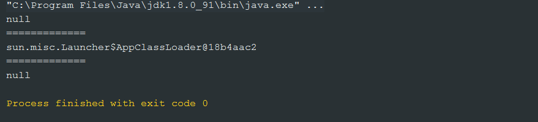

###### 解释

字符数组的类加载器和字符数组的元素的类加载器是一致的（*对于数组实例来说，其类型是由jvm在运行期动态生成的*），都是根加载器。原生类型数组没有类加载器。

##### 二进制名字

任何类的名字都是通过字符串的形式，作为类加载器的方法的参数，称之为二进制的名字，这是Java虚拟机规范制定的。

例如：

~~~~java
"java.lang.String" // 表示String类
"javax.swing.JSpinner$DefaultEditor" // 表示JSpinner中的内部类DefaultEditor
"java.security.KeyStore$Builder$FileBuilder$1" // 表示KeyStore里边的内部类Builder的内部类FileBuilder里边的第一个匿名内部类
"java.net.URLClassLoader$3$1" // 表示URLClassLoader里边的第三个匿名内部类里边的第一个匿名内部类
~~~~

#### 12、自定义类加载器深入详解


#### 13、类加载器重要方法详解


#### 14、类加载器双亲委托机制实例深度剖析


#### 15、类的命名空间与卸载详解及jvisualvm使用


#### 16、自定义类加载器在复杂类加载情况下的运行分析


#### 17、类加载器命名空间实战剖析与透彻理解


#### 18、类加载器实战剖析与疑难点解析


#### 19、类加载器命名空间深度解析与实例分析


#### 20、类加载器命名空间总结与扩展类加载器要点分析


#### 21、平台特定的启动类加载器深入分析与自定义系统类加载器详解


#### 22、Launcher类源码分析


#### 23、自定义系统类加载器源码分析与forName方法底层剖析


#### 24、线程上下文类加载器分析与实现


#### 25、线程上下文类加载器本质剖析与实做


#### 26、ServiceLoader在SPI中的重要作用分析


#### 27、线程上下文类加载器实战分析与难点剖析


#### 28、通过JDBC驱动加载深刻理解线程上下文类加载器机制


#### 29、JVM类加载器阶段性总结与学习方式升级


#### 30、技术学习思维方式谈心


#### 31、类加载器系统回顾与内容延伸


#### 32、类加载器精华部分讲解


#### 33、类加载器系统总结与展望


#### 34、Java字节码文件结构剖析


#### 35、Java字节码常量池深入剖析


#### 36、透彻分析常量池常量结构与描述符


#### 37、Java字节码常量池深度剖析与字节码整体结构分解


#### 38、字节码访问标志与字段表详解


#### 39、Java字节码方法表与属性表深度剖析


#### 40、Java字节码方法表结构深度剖析


#### 41、Java字节码方法表与属性表详解


#### 42、Java字节码整体分析与总结


#### 43、synchronized关键字所生成的字节码详细分析


#### 44、复杂字节码文件的分析过程


#### 45、构造方法与静态代码块字节码指令详解


#### 46、通过字节码分析this关键字以及异常表的重要作用


#### 47、通过字节码分析Java异常处理机制


#### 48、栈帧与操作数栈剖析及符号引用与直接引用的转换


#### 49、方法重载与invokevirtual字节码指令的关系


#### 50、通过字节码分析Java方法的静态分派与动态分派机制


#### 51、虚方法表与动态分派机制详解


#### 52、基于栈的指令集与基于寄存器的指令集详细比对


#### 53、JVM执行栈指令集实例剖析


#### 54、透过字节码生成审视Java动态代理运作机制


#### 55、动态代理实现机制深层次分析与动态字节码生成总结


#### 56、JVM字节码整体回顾与总结


#### 57、JVM内存空间划分与作用详解


